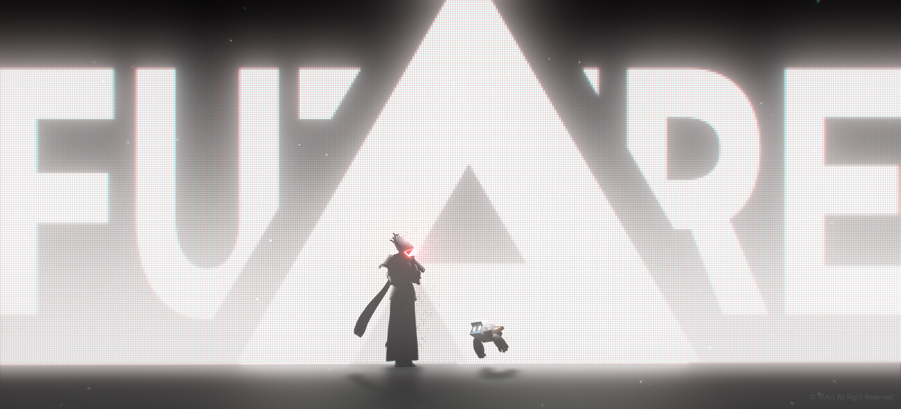

# 🌌 My Personal Linux Wallpapers Collection

[](https://www.kernel.org/)
[](https://opensource.org/licenses/MIT)

> **Deskripsi:** Repositori publik yang berisi kumpulan wallpaper pilihan berkualitas tinggi (HD/4K) untuk kustomisasi desktop Linux (_desktop ricing_). Sangat cocok dipadukan dengan Tiling Window Manager (seperti Hyprland, i3wm, Sway) maupun Desktop Environment modern.

---

## 📸 Galeri & Pratinjau Wallpaper

Berikut adalah daftar wallpaper yang tersedia di dalam repositori ini. Jalur gambar di bawah ini menggunakan tautan relatif yang akan langsung menampilkan gambar begitu kamu memasukkannya ke dalam folder `wallpapers/`:

| Nama Wallpaper     |                           Preview                           |    Resolusi / Tema    |
| :----------------- | :---------------------------------------------------------: | :-------------------: |
| **CAM**            |        | 4K / Cyberpunk / Mono |
| **Evangelion Rei** |  |   4K / Anime / Blue   |
| **Expanse**        |                   |  4K / Space / Nature  |
| **Moonlight**      |           |  4K / Nature / Moon   |

---

## 🚀 Panduan Penggunaan, Struktur File, dan Informasi Kontak

Untuk menggunakan repositori ini, kamu bisa langsung mengunduh seluruh koleksi wallpaper ke komputer lokal dengan menjalankan perintah `git clone https://github.com/goblock1938/linux-wallpapers.git` lalu masuk ke foldernya menggunakan perintah `cd linux-wallpapers`.

Agar skrip pengatur wallpaper kamu (seperti `swww`, `feh`, atau `hyprpaper`) berjalan lancar dan semua gambar pada tabel pratinjau di atas tampil dengan benar, pastikan seluruh file gambar disimpan di dalam folder `wallpapers/` dengan struktur internal sebagai berikut:

```text
.
├── README.md
└── wallpapers/
    ├── futuristic-blue.png
    ├── minimal-dark.png
    ├── retro-wave.png
    ├── anime-aesthetic.png
    └── . . . . . . . .png
```
